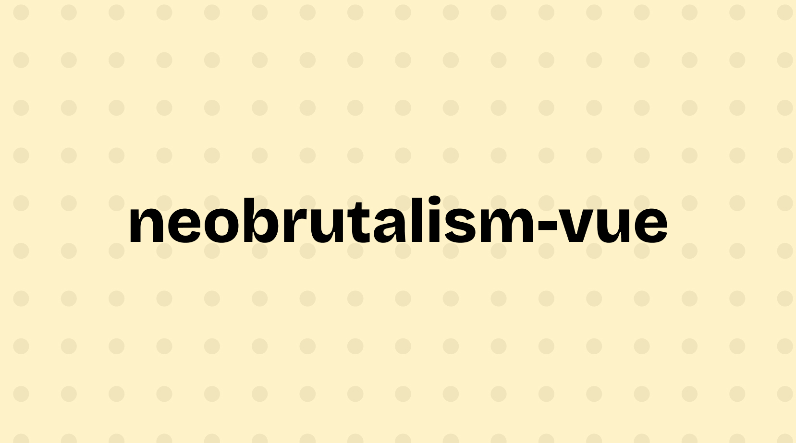

[neobrutalism-vue](https://neobrutalism-vue.com) curates neobrutalist [Vue](https://vuejs.org) components styled for Tailwind v4 based on [shadcn-vue](https://shadcn-vue.com).

### Components

[Browse the catalog](https://www.neobrutalism-vue.com/components)

### Usage

Install components straight from the registry. For example:

```bash
npx shadcn-vue@latest add https://neobrutalism-vue.com/r/accordion.json
```

### Credits

- [shadcn/ui](https://ui.shadcn.com) for the original idea and guidance.
- [shadcn-vue](https://www.shadcn-vue.com) for the Vue implementation of shadcn/ui.
- [Reka UI](https://reka-ui.com) for the accessible primitives powering the components.
- [VueUse](https://vueuse.org) for utilities used throughout the examples.

### License

Licensed under the [MIT license](LICENSE).
